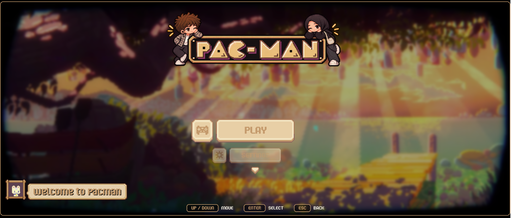
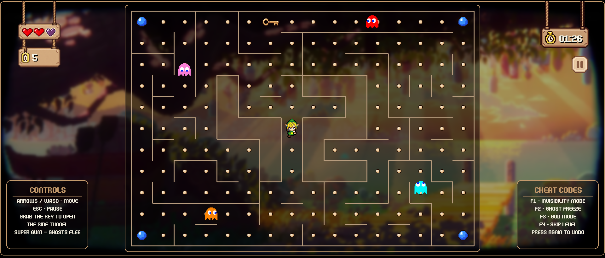
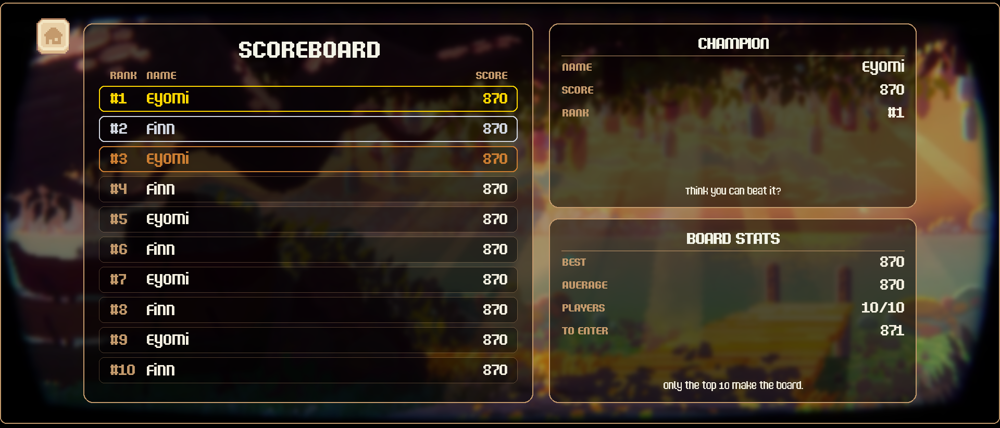
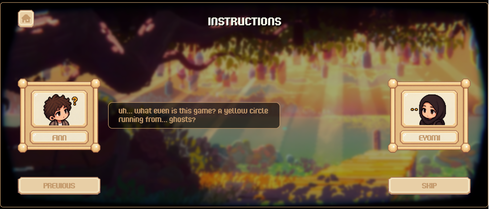
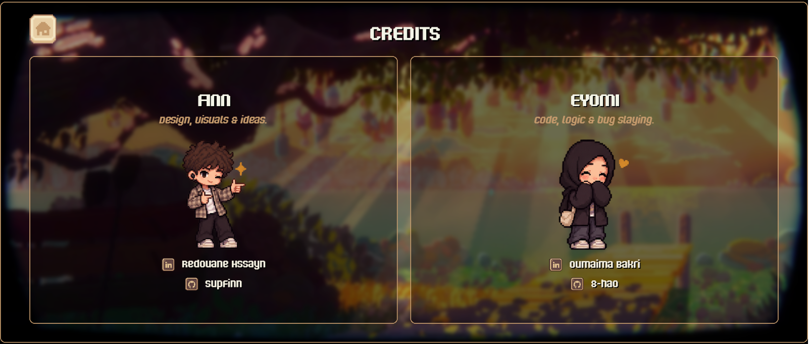
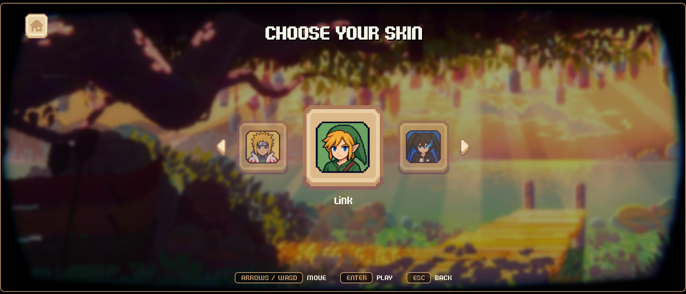

*This project has been created as part of the 42 curriculum by rhssayn, obakri.*

# 🟡 Pacman game 👻

## 📖 Description

This project is a Python recreation of the classic 1980 arcade game Pac-Man, built from scratch using pygame for rendering and object-oriented design for the game logic. The goal was to reproduce the core Pac-Man experience: a player navigating a maze, eating pacgums, avoiding four ghosts with distinct movement behaviors, and using power pellets to briefly turn the tables and eat the ghosts back.

Each ghost (Blinky, Pinky, Inky, Clyde) uses a different targeting strategy, and all of them share the same Normal / Frightened / Eaten state machine, so every ghost reacts consistently to power pellets while keeping its own personality when chasing.

Main features:

- 🎯 20 levels (1-10 are the main game, 11-20 are optional), each with a time limit.
- 👫 1-player and 2-player modes, with 12 selectable skins.
- 🕹️ A cheat mode for evaluation (invisibility, ghost freeze, god mode, level skip).
- 💾 A persistent JSON-based highscore system (top 10).
- 🔧 A fully custom JSON-with-comments configuration file, so gameplay parameters (lives, scoring, level timing, maze size...) can be tuned without touching code.
- 🎨 A main menu with themes (background videos and music), sound settings, scoreboard and an instructions screen.
- 📦 A packaged build published on itch.io.

## 🎬 Demonstration

<div align="center">

### 🎥 Gameplay


### 🖼️ In-Game Screenshots

| 🏠 Menu | 👾 Gameplay | 🏆 Scoreboard |
|:---:|:---:|:---:|
|  |  |  |

| 📖 Instructions | 👥 Credits | 🎭 Skins |
|:---:|:---:|:---:|
|  |  |  |

</div>

## 🚀 Instructions

### 📋 Requirements

- Python 3.12 (the project is pinned to `>=3.12,<3.13` in `pyproject.toml`)
- [uv](https://docs.astral.sh/uv/) for dependency management and running the project

### 📦 Installation

Clone the repository, then install the dependencies with:

```bash
make install
```

This runs `uv sync`, which creates a virtual environment and installs everything listed in `pyproject.toml` (including pygame, rich, and the assigned `mazegenerator` package).

### 🛠️ Makefile rules

| Rule | What it does |
|---|---|
| `make install` | Install the dependencies |
| `make run` | Run the game with `config.json` |
| `make debug` | Run the game through Python's debugger (pdb) |
| `make clean` | Remove `__pycache__`, `.mypy_cache` and other caches |
| `make lint` | Run flake8 and mypy with the required flags |
| `make package` | Build the packaged game with PyInstaller |
| `make zip` | Build the package and compress it for upload |

### ▶️ Running the game

The game is launched from the command line and takes exactly one argument: a path to a JSON configuration file.

```bash
make run
```

By default this runs `uv run python3 pac-man.py config.json`. To use a different config file, run it directly:

```bash
uv run python3 pac-man.py path/to/your_config.json
```

If the config file is missing, malformed, or contains invalid values, the game prints a clear error message instead of crashing with a Python traceback.

### 🎮 Controls

| Key | Action |
|---|---|
| Arrows / WASD | Move (2 players: P1 = WASD, P2 = arrows) |
| ESC | Pause / back |
| ENTER / SPACE | Select |
| F1 | Invisibility (ghosts cannot see you) |
| F2 | Freeze all ghosts |
| F3 | God mode (you cannot lose a life) |
| F4 | Skip the level |

Pressing a cheat key again turns it off.

## 🎁 Packaged version

The game is published on itch.io as a free, restricted (unlisted) build:

- Link: <[itch.io link](https://supfinn.itch.io/pac-man)>
- Password: pacman pacman

Download the zip, extract it and run the `PacMan` executable (on Linux you may need `chmod +x PacMan` first). No Python installation is needed. The package also contains a short `README.txt` with the controls and options.

To rebuild the package yourself, run `make package` (or `make zip` to also compress it). The build recipe is stored in `PacMan.spec` at the root of the repository.

## 🎮 Play / Download

<div align="center">

[](https://supfinn.itch.io/pac-man)

</div>

## ⚙️ Configuration

The game is configured through a JSON file passed as the single command-line argument:

```bash
python3 pac-man.py config.json
```

Comments starting with `#` or `//` are stripped before parsing, so the file can be annotated despite being plain JSON. The top-level keys are:

| Key | Meaning |
|---|---|
| `highscore_filename` | Path of the highscore file (must end in `.json`) |
| `lives` | Number of lives |
| `points_per_pacgum` | Points for a pacgum |
| `points_per_super_pacgum` | Points for a super pacgum |
| `points_per_ghost` | Points for an eaten ghost |
| `seed` | Seed for the maze generator |
| `levels` | Array where each entry sets `width`, `height` and `max_time` (seconds) for that level |

Maze `width` and `height` must be between 10 and 40. Unknown keys, non-integer values and out-of-range maze dimensions raise a clear validation error before the game starts, rather than crashing mid-run or failing silently.

Example:

```
# my configuration
{
    "highscore_filename": "highscores.json",
    "lives": 3,
    "points_per_pacgum": 10,
    "points_per_super_pacgum": 50,
    "points_per_ghost": 200,
    "seed": 42,
    "levels": [
        {"width": 15, "height": 15, "max_time": 90}
    ]
}
```

## 🏆 Highscore

Scores are persisted to the JSON file named in the config (`highscore_filename`), and only the top 10 are ever kept. Each entry is stored as a `(score, name)` tuple, loaded from disk, and inserted into the correct sorted position with `bisect.insort_left` rather than appending and re-sorting the whole list.

Since the list never exceeds 10 items, this keeps insertion simple while staying correct. If a new score doesn't beat the current lowest of the top 10, it is discarded without ever touching the file; otherwise the lowest entry is dropped and the new one takes its place. Player names must be 3 to 10 characters long, using letters, digits and spaces only.

We chose JSON over something like a database because the data is small, needs no querying beyond "give me the top 10", and a plain file keeps the persistence layer easy to inspect, back up, or reset by hand during testing. File errors (missing file, invalid JSON, permission issues) are all caught and reported with clear messages, so a corrupted or absent highscore file never crashes the game.

In the packaged game, the file is saved in `~/.pacman/` (the user's home folder), because the install folder may be read-only and the scores must survive between runs.

## 🧩 Maze Generation

Each level's maze is produced by the assigned A-Maze-ing package (`mazegenerator`), used exactly as provided rather than modified. `Level.generate()` calls `MazeGenerator((width, height), False, seed=self.seed)`, with `PERFECT` set to `False` so the generator produces Pac-Man-compatible corridors.

The package returns a grid of integers where each cell is a bitmask of its closed walls (1 = north, 2 = east, 4 = south, 8 = west). Our own code never touches the generator's internals: it only consumes this grid to drive collision checks, gum placement and ghost pathfinding. This keeps our loader fully decoupled from the generator and able to adapt to a different assigned package, with changes confined to `Level.generate()`.

Pacgums are placed on every open cell, super pacgums in the four corners, one ghost starts in each corner, and the player spawns in the middle of the maze.

## 🧠 Implementation

The game is built in Python with pygame for rendering and input, structured around a clear split between game state and drawing: `GameState` owns all rules, timing and mutation (movement, collisions, scoring, level transitions), while the renderer only reads that state to draw it, never computing gameplay logic itself.

- **Movement:** the logic works on grid cells, while the display interpolates between the previous and current cell for smooth animation.
- **Ghosts** share a common `Ghost` base class with per-subclass targeting:
  - 🔴 *Blinky* chases directly via BFS shortest path.
  - 🩷 *Pinky* targets cells ahead of the player.
  - 🩵 *Inky* combines Blinky's position with the player's to compute an ambush point.
  - 🟠 *Clyde* switches between chasing and retreating to his corner based on squared distance.
- **Ghost states:** all four share a `GhostState` (Normal, Frightened, Eaten). Frightened ghosts move randomly, and eaten ghosts return to their corner by BFS before coming back.
- **Levels:** each level has its own time limit; winning level 10 wins the game, and levels 11-20 are optional.
- **Packaging:** PyInstaller (`--onedir`). Asset and config paths go through `resource_path()` so they work both from source and from the package.

## 🏗️ General Software Architecture

```
pac-man.py            # entry point: reads the config and starts the game
src/
├── entities/         # Player, Ghost (and its four subclasses), Level
├── game/             # Game (window and pages), GameState (rules, scoring,
│                     # collisions, timers), Parser (config loading/validation)
├── ui/               # menus, pages, skin/level selection, gameplay rendering
└── media/            # constants (sprite rects, frame tables), audio/video,
                      # sprite-sheet loading, resource paths
```

- `Game` owns the window and the pages (menu, skins, levels, scoreboard...).
- `GameState` owns the rules and is the single source of truth for the game.
- The UI reads `GameState` and draws it.
- Ghosts inherit from the abstract class `Ghost` and implement `move()`.

## 📅 Project Management

We are a team of two, and we split ownership by layer from the start:

- 👩‍💻 **Oumaima Bakri (obakri):** gameplay and systems: config parser, maze integration, ghost AI, collisions, levels, highscores, cheat mode, README and project documentation.
- 🎨 **Redouane Hssayn (rhssayn):** design and media: visual identity, menus and screens, sprites, background videos, audio, and lint/Makefile fixes,
and the packaging and itch.io deployment..

Technical choices inside each area were made independently and explained to the other afterward. Anything both of us had to build against (the `GameState` interface, sprite-frame data, the config format) was decided together first. Blocking bugs were debugged together, and disagreements were settled by quickly testing both options.

The full details (team organization, decisions, acceptance tests) are in the [project_management](project_management/) directory.

## 📚 Resources

- [Pygame documentation](https://www.pygame.org/docs/)
- [Python Game Development Tutorials](https://realpython.com/tutorials/gamedev/)
- [The Pac-Man Dossier](https://pacman.holenet.info/) (ghost behaviors)
- [PyInstaller documentation](https://pyinstaller.org/)
- [PEP 257 (docstrings)](https://peps.python.org/pep-0257/)
- [flake8](https://flake8.pycqa.org/) and [mypy](https://mypy.readthedocs.io/)
- [Pacman game](https://freepacman.org/)

### 🤖 Use of AI

AI was used for:

* explain how packaging works (PyInstaller) 📦
* clarify path concepts (relative vs absolute paths)🗂️
* help me reason about edge cases between our code and the subject (config validation, unknown keys, maze seeds per level), ✅


**made with 🤍**
By: **EYOMI & FINN**